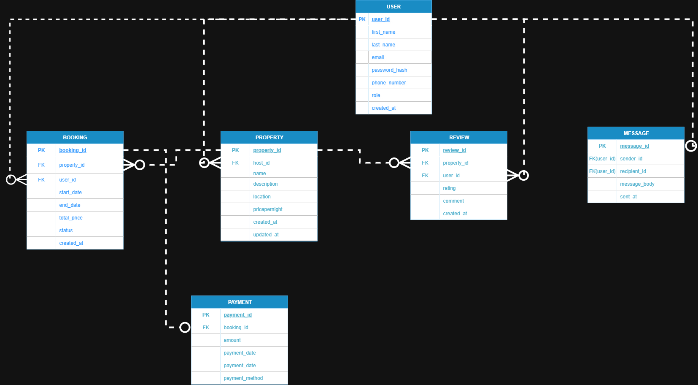

<!-- erDiagram
USER ||--o{ PROPERTY : hosts
USER ||--o{ BOOKING : makes
PROPERTY ||--o{ BOOKING : is_booked_in
BOOKING ||--o| PAYMENT : settles
PROPERTY ||--o{ REVIEW : receives
USER ||--o{ REVIEW : writes
USER ||--o{ MESSAGE : sends
USER ||--o{ MESSAGE : receives

USER {
uuid user_id PK
string first_name
string last_name
string email UNIQUE
string password_hash
string phone_number
enum role
timestamptz created_at
}

PROPERTY {
uuid property_id PK
uuid host_id FK
string name
text description
string location
numeric price_per_night
timestamptz created_at
timestamptz updated_at
}

BOOKING {
uuid booking_id PK
uuid property_id FK
uuid user_id FK
date start_date
date end_date
numeric total_price
enum status
timestamptz created_at
}

PAYMENT {
uuid payment_id PK
uuid booking_id FK
numeric amount
timestamptz payment_date
enum payment_method
}

REVIEW {
uuid review_id PK
uuid property_id FK
uuid user_id FK
int rating
text comment
timestamptz created_at
}

MESSAGE {
uuid message_id PK
uuid sender_id FK
uuid recipient_id FK
text message_body
timestamptz sent_at
} -->

<!--  -->
